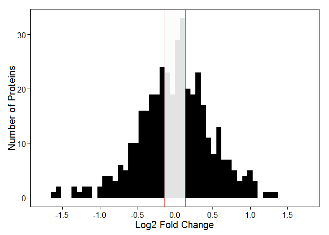

# Figure 2 for Niere and Namjoshi et al. 2015, MCP
Sanjeev V Namjoshi  
Revised for GitHub: August 10, 2015  
**Began writing code: February 2, 2014** 

To use this script you need the data generated from DataProcessing.R. In that
document this data was assigned to the variable "fullList".

First, load the libraries.


```r
library(ggplot2)
library(reshape2)
library(moments)
```

### Figure 2d

Import data.


```r
fullList <- read.csv("fullList.csv", header = TRUE)
```

Cosmetic changes and get data into long form. "HIGH" and "LOW" are changed to
NA. 


```r
fullList <- fullList[, -1]
fullList[fullList == "HIGH"] <- NA
fullList[fullList == "LOW"] <- NA
fullList <- apply(fullList, 2, as.numeric)
fullList <- melt(fullList)
fullList <- fullList[, -1]
colnames(fullList) <- c("Fraction", "Expression")
```

Subset the PSD fraction and generate the graph.


```r
histLongPSD <- subset(fullList, Fraction == "PSD")

binsize <- diff(range(na.omit(histLongPSD$Expression)))/50

a <- ggplot(histLongPSD, aes(x = Expression, fill = Fraction)) +
	geom_histogram(position = "identity", binwidth = binsize) +
	geom_vline(xintercept = 0, linetype = "dashed", color = "black", size = 0.3) +
	geom_vline(xintercept = 0.1375, linetype = "solid", color = "red", size = 0.3) +
	geom_vline(xintercept = -0.1375, linetype = "solid", color = "red", size = 0.3) +
	scale_fill_manual(values = c("black")) +
	scale_x_continuous(limits = c(-1.75, 1.75), breaks = seq(-2, 2, by = 0.5)) +
	xlab("Log2 Fold Change") +
	ylab("Number of Proteins") +
	theme_bw() +
	theme(panel.grid.major = element_blank(), panel.grid.minor = element_blank(), 
				panel.background = element_blank(), axis.line = element_line(color = "black"))

a + 
	theme(text = element_text(size = 15)) +
	theme(legend.position = "none") +
	annotate("rect", xmin = -0.136, xmax = 0.1375, ymin = 0, ymax = Inf, fill = "grey99", alpha = 0.9)
```

 

### Statistics in Figure 2d Legend

Import the data sets needed.


```r
fullList <- read.csv("fullList.csv", header = TRUE)
fullListPSD <- fullList[ ,c(1,3)]
fullListPSD$PSD <- as.numeric(as.character(fullListPSD$PSD))
```

```
## Warning: NAs introduced by coercion
```

Number of proteins calculations (excludes out-of-range proteins):


```r
sum(fullListPSD$PSD > 0, na.rm = TRUE) 
```

```
## [1] 210
```

```r
sum(fullListPSD$PSD < 0, na.rm = TRUE) 
```

```
## [1] 191
```

```r
sum(complete.cases(fullListPSD$PSD)) 
```

```
## [1] 401
```

This yields 210 PSD proteins with fold changes greater than 0, 191 PSD proteins
with fold changes less than 0 and 401 total PSD proteins as reported.

Descriptive statistics reported in figure legend:


```r
mean(fullListPSD$PSD, na.rm = TRUE) # Mean
```

```
## [1] -0.006047828
```

```r
sd(fullListPSD$PSD, na.rm = TRUE) # Standard deviation
```

```
## [1] 0.4950849
```

```r
var(fullListPSD$PSD, na.rm = TRUE) # Variance (CI calculated in GraphPad)
```

```
## [1] 0.2451091
```

```r
skewness(fullListPSD$PSD, na.rm = TRUE) # Skewness
```

```
## [1] -0.39867
```

```r
kurtosis(fullListPSD$PSD, na.rm = TRUE) # Kurtosis
```

```
## [1] 4.136472
```

Bartlett's test for comparison of variance in fold-change across fractions.


```r
# Import Data and process
fullList <- read.csv("fullList.csv", header = TRUE)
fullList <- fullList[, -1]
fullList[fullList == "HIGH"] <- NA
fullList[fullList == "LOW"] <- NA
fullList <- apply(fullList, 2, as.numeric)
fullList <- melt(fullList)
fullList <- fullList[, -1]
colnames(fullList) <- c("Fraction", "Expression")
fullList <- fullList[complete.cases(fullList), ]

# Compute Bartlett's Test
bartlett.test(Expression~Fraction, fullList) # p < 0.0002 | Variances are different
```

```
## 
## 	Bartlett test of homogeneity of variances
## 
## data:  Expression by Fraction
## Bartlett's K-squared = 17.1834, df = 2, p-value = 0.0001856
```

### Figure 2e

Import the data.


```r
fullList <- read.csv("fullList.csv", header = TRUE, stringsAsFactors = FALSE)

nrow(subset(fullList, fullList$PSD == "HIGH", select = c("Gene", "PSD")))
```

```
## [1] 48
```

```r
nrow(subset(fullList, fullList$PSD == "LOW", select = c("Gene", "PSD")))
```

```
## [1] 58
```

However, note that for the out-of-range genes we used an even more stringent
classification. If either treatment had 2 zero values we would not classify it
as out-of-range because we could not reliably compute the fold-change. These
were manually removed after the script was written and thus shortens the list.
The graph shown in figure 2e was generated in GraphPad.


