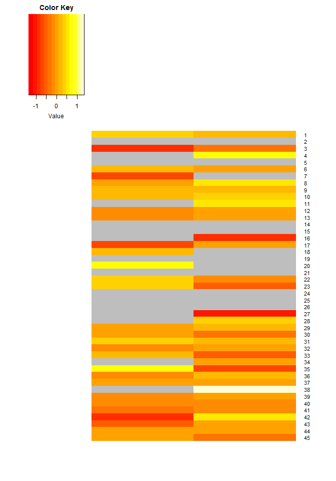
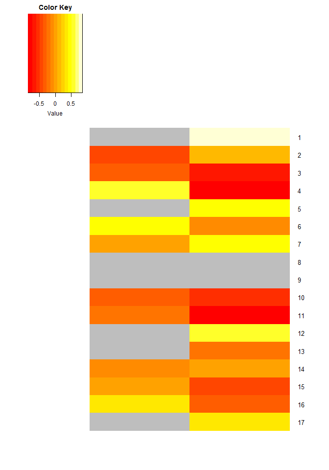
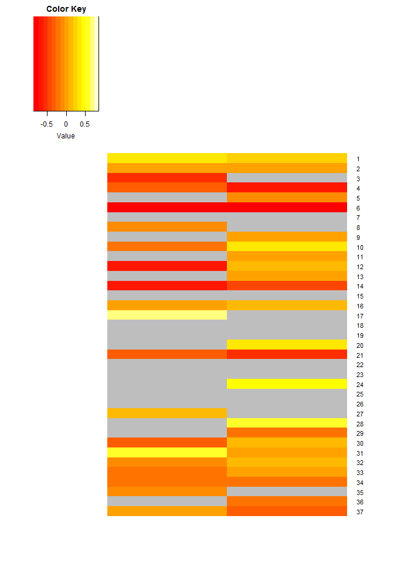

# Figure 3 for Niere and Namjoshi et al. 2015, MCP
Sanjeev V Namjoshi  
Revised for GitHub: August 10, 2015  
**Began writing code: February 28, 2014** 

To use this code you will need the proteins in Table S7A (cells A12:C615) and
"fullList.csv" which was generated in DataProcessng.R. You will also need the
list of mitchondrial genes in "mito.csv".

Load libraries and data lists.


```r
library(gplots)

# Disease lists
disease <- read.csv("diseaseCandidates.csv", header = TRUE, stringsAsFactors = FALSE, na.strings = "")

diseaseList <- list(Epilepsy = disease$Epilepsy,
										Alzheimers = disease$Alzheimers,
										ASD = disease$ASD)

diseaseList <- lapply(diseaseList, na.omit)
diseaseList <- lapply(diseaseList, as.data.frame) # Removes na.action attributes

# Mass spec list
fullList <- read.csv("fullList.csv", header = TRUE)
fullList$Gene <- toupper(fullList$Gene)  # Supp table is in uppercase, easier comparison

# Mitochondrial gene list
mito <- read.csv("mito.csv", header = FALSE, stringsAsFactors = FALSE)
mito <- toupper(mito[ ,1])
```

### Figure 1a

Process data and generate heatmap for epilepsy genes.


```r
epilepsy <- diseaseList$'Epilepsy'
epilepsy <- fullList[fullList$Gene %in% epilepsy[ ,1], ] # Filter to isolate genes in our dataset
epilepsy <- epilepsy[!epilepsy$Gene %in% mito, ]
epilepsy <- sapply(epilepsy[ ,2:4], function(x) as.numeric(as.character(x)))
epilepsyMatrix <- data.matrix(epilepsy)

# Labels and out-of-range gene textured boxes added manually in Inkscape later
heatmap.2(
	as.matrix(epilepsyMatrix[ ,c(2,3)]),
	dendrogram = "none",
	Rowv = NULL,
	Colv = NULL,
	col = "heat.colors",
	trace = "none", 
	na.color = "grey",
	density.info = "none",
	#key = TRUE,
	#keysize = 0.5,
	labCol = FALSE
)
```

 

### Figure 1b

Process data and generate heatmap for Alzheimer's genes


```r
alz <- diseaseList$'Alzheimers'
alz <- fullList[fullList$Gene %in% alz[ ,1], ] # Filter to isolate genes in our dataset
alz <- alz[!alz$Gene %in% mito, ]
alz <- sapply(alz[ ,2:4], function(x) as.numeric(as.character(x)))
alzMatrix <- data.matrix(alz)

# Labels and out-of-range gene textured boxes added manually in Inkscape later
heatmap.2(
	as.matrix(alzMatrix[ ,c(2,3)]),
	dendrogram = "none",
	Rowv = NULL,
	Colv = NULL,
	col = "heat.colors",
	trace = "none", 
	na.color = "grey",
	density.info = "none",
	#key = TRUE,
	#keysize = 0.5,
	labCol = FALSE
)
```

 

### Figure 1c

Process data and generate heatmap for ASD genes


```r
asd <- diseaseList$'ASD'
asd <- fullList[fullList$Gene %in% asd[ ,1], ] # Filter to isolate genes in our dataset
asd <- asd[!asd$Gene %in% mito, ]
asd <- sapply(asd[ ,2:4], function(x) as.numeric(as.character(x)))
asdMatrix <- data.matrix(asd)

# Labels and out-of-range gene textured boxes added manually in Inkscape later
heatmap.2(
	as.matrix(asdMatrix[ ,c(2,3)]),
	dendrogram = "none",
	Rowv = NULL,
	Colv = NULL,
	col = "heat.colors",
	trace = "none", 
	na.color = "grey",
	density.info = "none",
	#key = TRUE,
	#keysize = 0.5,
	labCol = FALSE
)	
```

 
