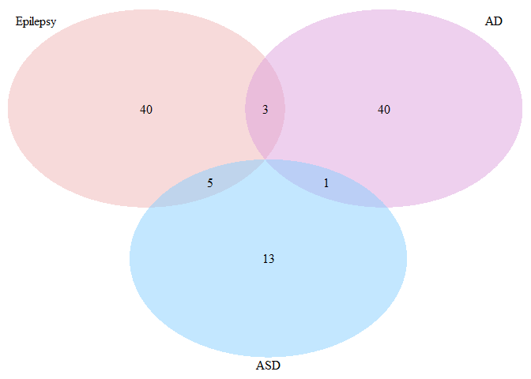

# Figure 6 for Niere and Namjoshi et al. 2015, MCP
Sanjeev V Namjoshi  
Revised for GitHub: August 10, 2015  
**Began writing code: March 15, 2014**

This code utilizes material from various disease databases (collected in diseaseCandidates.csv), the fullList.csv file generated in the dataprocessing step, and a disease list which includes the proteins from out mass spec data that overlap with the candidate proteins.

## Load libraries and process data


```r
library(VennDiagram)
```

Import data sets and process:

```r
# Disease lists
disease <- read.csv("diseaseCandidates.csv", header = TRUE, stringsAsFactors = FALSE, na.strings = "")

diseaseList <- list(Epilepsy = disease$Epilepsy,
										Alzheimers = disease$Alzheimers,
										ASD = disease$ASD)

diseaseList <- lapply(diseaseList, na.omit)

# Mass spec list
fullList <- read.csv("fullList.csv", header = TRUE)
fullList$Gene <- toupper(fullList$Gene)  # Supp table is in uppercase, easier comparison

# Epilepsy List
epilepsy <- diseaseList$'Epilepsy'
epilepsy <- fullList[fullList$Gene %in% epilepsy, ] # Filter to isolate genes in our dataset

# Alzheimer's List
alz <- diseaseList$'Alzheimers'
alz <- fullList[fullList$Gene %in% alz, ] # Filter to isolate genes in our dataset

# ASD List
asd <- diseaseList$'ASD'
asd <- fullList[fullList$Gene %in% asd, ] # Filter to isolate genes in our dataset
```

The VennSet function returns a list of each element of a 3-way Venn diagram. I am not the original author of this function; I believe I found this function in a StackExchange post. Please notify me if you come across the original source so I can give credit to the author.


```r
VennSet <- function(A, B, C)
{
	unionAB <- union(A, B)
	unionAC <- union(A, C)
	unionBC <- union(B, C)
	uniqueA <- setdiff(A, unionBC)
	uniqueB <- setdiff(B, unionAC)
	uniqueC <- setdiff(C, unionAB)
	intersAB <- setdiff(intersect(A, B), C)
	intersAC <- setdiff(intersect(A, C), B)
	intersBC <- setdiff(intersect(B, C), A)
	intersABC <- intersect(intersect(A, B), intersect(B, C))
	items <- list(A=uniqueA, B=uniqueB, C=uniqueC, AB=intersAB , AC=intersAC , BC=intersBC , ABC=intersABC)
	return(items)
}
```

## Figure 6A (left)

Find the different intersections and determine the number of elements in each. This is what will be fed into the Venn diagram.


```r
diseaseVenn <- VennSet(diseaseList$Epilepsy, diseaseList$Alzheimers, diseaseList$ASD)
lapply(diseaseVenn, length)
```

```
## $A
## [1] 319
## 
## $B
## [1] 184
## 
## $C
## [1] 532
## 
## $AB
## [1] 11
## 
## $AC
## [1] 57
## 
## $BC
## [1] 12
## 
## $ABC
## [1] 2
```

Draw the Venn diagram. In the paper the numbers and shapes for the Venn diagram were entered manually. I have reproduced them here with R code.


```r
grid.newpage()
draw.triple.venn(area1 = 389, area2 = 209, area3 = 603, n12 = 13, n23 = 14, n13 = 59, 
								 n123 = 2, category = c("Epilepsy", "AD", "ASD"), lty = "blank", 
								 fill = c("brown1", "darkorchid2", "lightslateblue"))
```

 

```
## (polygon[GRID.polygon.1], polygon[GRID.polygon.2], polygon[GRID.polygon.3], polygon[GRID.polygon.4], polygon[GRID.polygon.5], polygon[GRID.polygon.6], text[GRID.text.7], text[GRID.text.8], text[GRID.text.9], text[GRID.text.10], text[GRID.text.11], text[GRID.text.12], text[GRID.text.13], text[GRID.text.14], text[GRID.text.15], text[GRID.text.16])
```

## Figure 6B (right)

First we need to import the list of disease candidates found in our mass spec data


```r
OurDiseaseList <- read.csv("Diseases.csv", header = TRUE)
OurDiseaseList.list <- list(A = OurDiseaseList[,1], B = OurDiseaseList[,2], C = OurDiseaseList[,3])
```

Find the intersections and determine the number of elements in each.


```r
disease.Venn <- VennSet(OurDiseaseList.list$A, OurDiseaseList.list$B, OurDiseaseList.list$C)
lapply(disease.Venn, length)
```

```
## $A
## [1] 40
## 
## $B
## [1] 40
## 
## $C
## [1] 13
## 
## $AB
## [1] 3
## 
## $AC
## [1] 5
## 
## $BC
## [1] 1
## 
## $ABC
## [1] 1
```

Draw the Venn diagram.


```r
grid.newpage()
draw.triple.venn(area1 = 48, area2 = 44, area3 = 19, n12 = 3, n23 = 1, n13 = 5, 
								 n123 = 0, category = c("Epilepsy", "AD", "ASD"), lty = "blank", 
								 fill = c("rosybrown2", "plum", "skyblue1"))
```

 

```
## (polygon[GRID.polygon.17], polygon[GRID.polygon.18], polygon[GRID.polygon.19], polygon[GRID.polygon.20], polygon[GRID.polygon.21], polygon[GRID.polygon.22], text[GRID.text.23], text[GRID.text.24], text[GRID.text.25], text[GRID.text.26], text[GRID.text.27], text[GRID.text.28], text[GRID.text.29], text[GRID.text.30], text[GRID.text.31])
```
