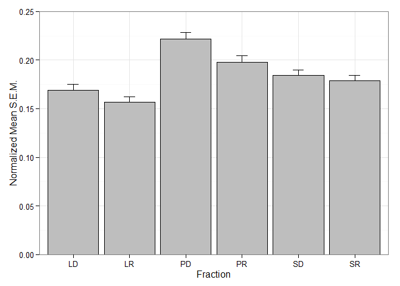
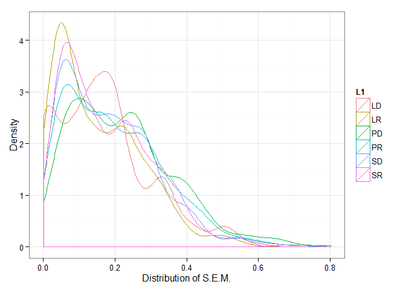
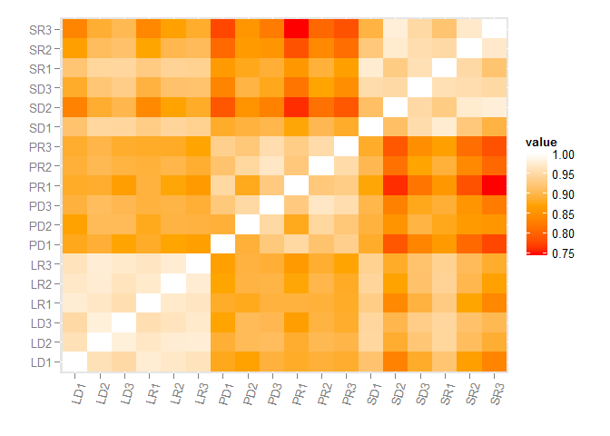

# Supplemental Figures (S1/S2) for Niere and Namjoshi et al. 2015, MCP
Sanjeev V Namjoshi  
Revised for GitHub: August 10, 2015  

**Began writing code: January 29, 2015**

This document includes the code needed to calculate the coefficient of determination between samples of fractions and the measurement of error between the fractions. A correlation matrix is also included though this was not reported in the publication.

## Data processing and package loading

First, load the packages.


```r
library(ggplot2)
library(reshape2)
```

Load the data and get into tidy format. RawData.csv is the data in Supplemental Table 1A from cells B12:T756. The only difference is that the rows have been sorted alphabetically.


```r
raw <- read.csv("RawData.csv", header = TRUE, stringsAsFactors = FALSE)

names(raw) <- c("Protein", "LD1", "LD2", "LD3", 
								"LR1", "LR2", "LR3",
								"PD1", "PD2", "PD3",
								"PR1", "PR2", "PR3",
								"SD1", "SD2", "SD3",
								"SR1", "SR2", "SR3")

rownames(raw) <- raw[, "Protein"]
raw <- raw[, -1]
```

The `prop()` function will be used to determine the variance across the different proteins (reliability of spectral counts). The function first calculates the standard error among the proteins by treatment. These standard errors are then normalized by the mean spectral count for the protein. This gives the mean standard error for all proteins by treatment.


```r
prop <- function(cols){
	x <- raw[, cols]
	x <- x[rowSums(x == 0) <= 1, ]
	x[x == 0] <- NA
	
	x.var <- apply(x, 1, function(r) {
		sd(r, na.rm = TRUE) / sqrt(sum(!is.na(r)))
	})
	
	x.prop <- x.var / rowMeans(x, na.rm = TRUE)
	return(x.prop)
}
```

The `prop()` function is then applied to all fractions.


```r
totals <- list(LD = prop(1:3),
							 LR = prop(4:6),
							 PD = prop(7:9),
							 PR = prop(10:12),
							 SD = prop(13:15),
							 SR = prop(16:18))
```

## Bar Charts for figures S1 and S2

A standard error function for use below.


```r
se <- function(x) sqrt(var(x)/length(x))
```

Arrange the data for graphing by calculating the mean and standard deviation and putting them into a data frame.


```r
totals.mean <- sapply(totals, mean)
totals.se <- sapply(totals, se)
totals.bar <- data.frame(Mean = totals.mean, SE = totals.se)
```

For the publication, we put these values into GraphPad. The graph can be replicated in R with the following code:


```r
ggplot(totals.bar, aes(x = rownames(totals.bar), y = Mean, fill = rownames(totals.bar), color = rownames(totals.bar))) +
	geom_bar(stat = "identity", color = "black", fill = "grey") +
	geom_errorbar(aes(ymin = Mean + 0, ymax = Mean + SE), width = 0.2, color = "black") +
	xlab("Fraction") +
	ylab("Normalized Mean S.E.M.") +
	coord_cartesian(ylim = c(0,0.25)) +
	theme_bw()
```

 

The following is not included in the paper but may be useful. We can plot the probability density functions for each of the fractions and see how the distrubution of standard errors compares.


```r
totals.long <- melt(totals)

ggplot(totals.long, aes(x = value, color = L1)) +
	geom_density() +
	xlab("Distribution of S.E.M.") +
	ylab("Density") +
	theme_bw()
```

 

## Correlations for figures S1 and S2

Here we use the coefficient of determination to see the correlation of the triplicate measurements among all normalized spectral counts by treatment and fraction. We will still use the raw data loaded above for the analysis (storted in the variable `raw`). 

The correlations need to be done in sets of three. We can create the pattern sequence we need for each set with the code displayed below. We will store the pattern key-index in the variable `m`.


```r
v1 <- c(1:18) 
v2 <- v1+1L 
v3 <- c(0,0,3L) 
v2 <- v2-v3
m <- cbind(v1,v2)
```

We apply the `lm()` function to the raw data and extracted `r.squared` in sets of three. The key specifies the pattern in which the correlations are to be computed. We assign the correlations to the variable `fit`. 


```r
fit <- lapply(1:length(raw),function(x) summary(lm(raw[,m[x,1]]~raw[,m[x,2]]))$r.squared)
```

Now we just have to make some cosmetic adjustments to make fit look tidy.


```r
data.frame(Fraction = c(rep("Lysate", 6), rep("PSD", 6), rep("Soluble", 6)),
					 Treatment = rep(c("DMSO","RAPA"), 3, each = 3),
					 Replicate = rep(c("1 vs 2", "2 vs 3", "3 vs 1"), 6),
					 R2 = round(unlist(fit), 3))
```

```
##    Fraction Treatment Replicate    R2
## 1    Lysate      DMSO    1 vs 2 0.922
## 2    Lysate      DMSO    2 vs 3 0.959
## 3    Lysate      DMSO    3 vs 1 0.900
## 4    Lysate      RAPA    1 vs 2 0.943
## 5    Lysate      RAPA    2 vs 3 0.949
## 6    Lysate      RAPA    3 vs 1 0.931
## 7       PSD      DMSO    1 vs 2 0.794
## 8       PSD      DMSO    2 vs 3 0.898
## 9       PSD      DMSO    3 vs 1 0.856
## 10      PSD      RAPA    1 vs 2 0.855
## 11      PSD      RAPA    2 vs 3 0.905
## 12      PSD      RAPA    3 vs 1 0.867
## 13  Soluble      DMSO    1 vs 2 0.832
## 14  Soluble      DMSO    2 vs 3 0.900
## 15  Soluble      DMSO    3 vs 1 0.907
## 16  Soluble      RAPA    1 vs 2 0.900
## 17  Soluble      RAPA    2 vs 3 0.941
## 18  Soluble      RAPA    3 vs 1 0.843
```

Additionally, we can also look at a correlation matrix. This does not appear in the publication but may also be useful.

Find correlations across the entire data.

```r
corDat <- cor(raw)
corDatMelt <- melt(corDat)
```

To make the graph more readable we have scaled the colors in the correlation matrix across the range of R squared values (rather than scaled over 0 to 1). This makes the color shading much more readable visually. First we create a midpoint function. Then we find the midpoint of the correlations and set it to `mdpt`. This is then set as the midpoint of the color gradient in the `scale_fill_gradient2()` function call.


```r
# Function to calculate midpoint for use in color scale
midpoint <- function(x) {
    ((max(x) - min(x))/2) + min(x)
}

# Set midpoint of data to variable mdpt
mdpt <- midpoint(corDatMelt$value)

# Plot correlation matrix
ggplot(corDatMelt, aes(x = Var1, y = Var2, fill = value)) +
    geom_tile() +
    scale_fill_gradient2(low = "red", mid = "orange", high = "white", midpoint = mdpt) +
    theme(axis.text.x = element_text(angle = 75, hjust = 1, vjust = 1)) +
    xlab("") +
    ylab("")
```

 


	
